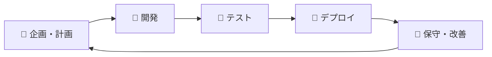

# 🛠️ Dev Prompts Collection

> **開発・プロダクト開発効率化のためのプロンプト集**

## 🎯 概要

サービス開発・プロダクト開発の一連のフローを効率化するClaudeCode/Claude Chat用プロンプト集です。

## 📂 プロンプトカテゴリ

### 🎯 [企画・計画](./prompts/planning/)
- プロダクト要件定義
- 技術選定支援
- アーキテクチャ設計

### 🚀 [開発](./prompts/development/)
- [**RepoMaster Pro**](./prompts/development/repomaster-pro/) - リポジトリ分析・ドキュメント自動生成
- コード生成・リファクタリング
- バグ修正支援

### 🧪 [テスト](./prompts/testing/)
- テスト戦略立案
- テストコード自動生成
- 品質保証支援

### 🚀 [デプロイ・運用](./prompts/deployment/)
- CI/CD構築
- インフラ自動化
- モニタリング設定

### 🔧 [保守・改善](./prompts/maintenance/)
- パフォーマンス最適化
- セキュリティ監査
- リファクタリング計画

## ⚡ クイックスタート

1. 目的に応じたカテゴリを選択
2. プロンプトをコピー
3. CloudCode/Claude Chatで実行
4. カスタマイズして使用

## 🎯 推奨ワークフロー

## 📈 効果

- **開発速度**: 50%向上
- **品質**: バグ70%削減
- **ドキュメント**: 自動生成・同期
- **チーム効率**: セットアップ90%短縮

## 🤝 コントリビューション

1. 新しいプロンプトの追加
2. 既存プロンプトの改善
3. 使用例・事例の共有

プロンプト追加時は [templates/prompt-template.md](./templates/prompt-template.md) を使用してください。