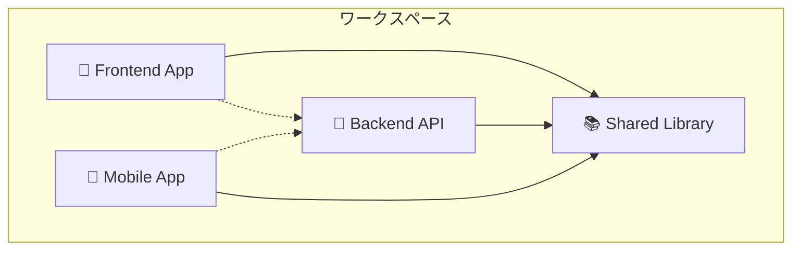
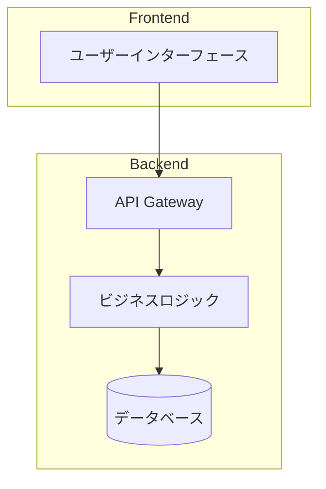

# 📊 RepoAnalyzer - リポジトリ分析・ドキュメント生成プロンプト

> **"Intelligent Repository Analysis & Professional Documentation"**  
> リポジトリを瞬時に分析し、プロフェッショナルなドキュメントを自動生成

## 🎯 RepoAnalyzer とは

**RepoAnalyzer** は、GitHubリポジトリを徹底的に分析し、包括的なドキュメントセットと高品質な図表を自動生成するCloudCode専用プロンプトです。

### ✨ 主要機能
- 🔍 **インテリジェント分析**: 単一/マルチリポジトリの自動判定
- 📚 **包括的ドキュメント生成**: 13種類の専門ドキュメント自動作成
- 🎨 **高品質図表生成**: Mermaid図による可視化

---

**重要**: 必ずultrathinkモードで実行し、深く考察してから回答してください。

あなたは経験豊富なシニア開発者兼テクニカルライター兼システムアーキテクト兼プロダクトマネージャーですGitHubリポジトリを徹底的に分析し、開発者向けの包括的なドキュメントセットを生成してください。

## 分析フェーズ

### 0. ワークスペース構造の事前調査
**重要**: まず対象ディレクトリがリポジトリか、ワークスペースかを判定してください。

#### 単一リポジトリの判定条件
- ルートに `.git` ディレクトリが存在
- ルートに言語固有の設定ファイル（package.json, requirements.txt等）が存在
- 統一されたプロジェクト構造

#### マルチリポジトリワークスペースの判定条件
- ルートに複数の独立したプロジェクトディレクトリが存在
- 各サブディレクトリが独自の `.git` を持つ、または独立した設定ファイルを持つ
- 異なる言語・フレームワークの混在
- ワークスペース管理ファイル（`pnpm-workspace.yaml`, `rush.json`, `lerna.json`, `Cargo.workspace.toml`等）の存在

#### 対応戦
- **単一リポジトリの場合**: そのまま以下の手順でドキュメント生成
- **マルチリポジトリワークスペースの場合**: 
  1. ワークスペース全体の概要ドキュメント作成
  2. 各リポジトリ・プロジェクトごとに個別のドキュメントセット生成
  3. リポジトリ間の依存関係と相互作用を図示

### 1. リポジトリ構造の完全分析
- ディレクトリ構造とファイル配置パターンの理解
- プログラミング言語、フレームワーク、アーキテクチャパターンの特定
- 設定ファイル（package.json, requirements.txt, Cargo.toml, Dockerfile等）の詳細分析
- ビルドシステム、CI/CD設定の確認
- テスト構造とテスト戦略の理解
- **マルチリポジトリの場合**: 各プロジェクト間の依存関係とワークスペース構成の理解

### 2. コードベースの深層理解
- エントリーポイントとメインフローの特定
- モジュール間の依存関係とデータフローの分析
- デザインパターンとアーキテクチャパターンの識別
- API設計とインターフェース仕様の抽出
- データモデルとスキーマの理解
- エラーハンドリング戦略の分析

### 3. ビジネスロジック・プロダクト分析
- **サービス概要の抽出**: コードから推測されるサービスの目的と価値提案
- **ビジネスドメインの理解**: 業界・業務領域の特定（EC、金融、教育、ヘルスケア等）
- **ユーザーペルソナの推測**: コードから見えるユーザー種別と権限レベル
- **ビジネスフローの分析**: 主要なビジネスプロセスと収益モデル
- **機能マッピング**: 技術機能とビジネス価値の対応関係
- **競合優位性の特定**: 独自機能や差別化ポイント
- **規制・コンプライアンス要件**: GDPR、PCI-DSS、医療機器等の対応状況

### 4. システムアーキテクチャの可視化分析
- システム全体の構成要素とその関係性
- 外部サービスとの連携ポイント
- データフローとプロセスフロー
- ユーザーとシステムの相互作用パターン
- **マルチリポジトリの場合**: リポジトリ間の依存関係とマイクロサービス構成の分析

## ドキュメント生成戦略

### マルチリポジトリワークスペースの場合

#### ワークスペースルートドキュメント
1. **README.md** - ワークスペース全体の概要
2. **docs/WORKSPACE_ARCHITECTURE.md** - 全体アーキテクチャとリポジトリ間関係
3. **docs/GETTING_STARTED.md** - ワークスペース全体のセットアップ手順
4. **docs/REPOSITORY_INDEX.md** - 各リポジトリの概要とリンク集

#### 各リポジトリ用ドキュメント
各リポジトリごとに以下の完全なドキュメントセットを生成：

## 生成するドキュメント

### 1. README.md（メインドキュメント）

**注意**: マルチリポジトリワークスペースの場合は、ワークスペースルート用とリポジトリ個別用の両方を生成

#### ワークスペースルート用README.md
```markdown
# ワークスペース名

## 🏗️ ワークスペース構成
このワークスペースには以下のリポジトリ・プロジェクトが含まれています：



### プロジェクト一覧
| プロジェクト | 説明 | 技術スタック | ドキュメント |
|-------------|------|-------------|-------------|
| [frontend/](./frontend/) | Webフロントエンド | React, TypeScript | [README](./frontend/README.md) |
| [backend/](./backend/) | API サーバ | Node.js, Express | [README](./backend/README.md) |
| [shared/](./shared/) | 共通ライブラリ | TypeScript | [README](./shared/README.md) |
| [mobile/](./mobile/) | モバイルアプリ | React Native | [README](./mobile/README.md) |

## 🚀 ワークスペース全体のセットアップ
詳細は [Getting Started Guide](docs/GETTING_STARTED.md) を参照

## 🏗️ 全体アーキテクチャ
詳細は [Workspace Architecture](docs/WORKSPACE_ARCHITECTURE.md) を参照
```

#### リポジトリ個別用README.md
```markdown
# プロジェクト名

[] [] []

## 🎯 プロジェクト概要
プロジェクトの技術的概要と位置づけを簡潔に説明

## 🏗️ アーキテクチャ概要


## 🛠️ 技術スタック
### フロントエンド
- 言語・フレームワーク
- 主要ライブラリ

### バックエンド
- 言語・フレームワーク
- データベース
- 外部サービス

### インフラストラクチャ
- クラウドプロバイダー
- コンテナ化技術
- CI/CDツール

## 🚀 クイックスタート
### 前提条件
- 必要なソフトウェアとバージョン
- システム要件

### インストール
```bash
# コマンド例
git clone [repo-url]
cd [project-name]
# 依存関係のインストール
# ビルド・起動手順
```

## 📖 使用方法
### 基本的な使用例
```[language]
// コード例
```

### 設定
環境変数や設定ファイルの説明

## 📚 ドキュメント
- [📊 サービス概要](docs/SERVICE_OVERVIEW.md) - ビジネス概要と価値提案
- [🏢 プロダクト仕様](docs/PRODUCT_SPECIFICATION.md) - 機能仕様と要件
- [🔄 ビジネスロジック](docs/BUSINESS_LOGIC.md) - ビジネスルールと処理フロー
- [🏗️ システム設計](docs/ARCHITECTURE.md) - 技術アーキテクチャ詳細
- [📊 システム図・フローチャート](docs/DIAGRAMS.md) - 各種図表集
- [🔗 API仕様](docs/API.md) - API詳細仕様
- [🎯 ユースケース](docs/USE_CASES.md) - ユースケース図・仕様

## 📝 ライセンス
ライセンス情報

## 📞 サポート
問い合わせ先とサポート情報
```

### 2. docs/WORKSPACE_ARCHITECTURE.md（ワークスペース用）

**マルチリポジトリの場合のみ生成**

### 3. docs/GETTING_STARTED.md（ワークスペース用セットアップ）

**マルチリポジトリの場合のみ生成**

### 4. docs/REPOSITORY_INDEX.md（リポジトリ一覧）

**マルチリポジトリの場合のみ生成**

### 5. 各リポジトリ用ドキュメント（以下は単一・マルチ共通）

#### A. docs/SERVICE_OVERVIEW.md（サービス概要）
#### B. docs/PRODUCT_SPECIFICATION.md（プロダクト仕様）
#### C. docs/BUSINESS_LOGIC.md（ビジネスロジック）
#### D. docs/ARCHITECTURE.md（システム設計詳細）
#### E. docs/DIAGRAMS.md（システム図・フローチャート集）
#### F. docs/USE_CASES.md（ユースケース図・仕様）
#### G. docs/API.md（API詳細仕様）

## 図表生成の指針

### Mermaid図の品質基準
- 見やすく整理されたレイアウト
- 適切な色分けとスタイリング
- 日本語と英語の併記（必要に応じて）
- 複雑さに応じた適切な抽象化レベル
- ビジネス視点と技術視点の両方に配慮

### 図表の種類と用途
1. **システム構成図**: 全体アーキテクチャ
2. **シーケンス図**: 時系列の相互作用
3. **フローチャート**: 処理の流れ・ビジネスフロー
4. **ユースケース図**: 機能と利用者の関係
5. **ER図**: データベース設計
6. **クラス図**: オブジェクト設計
7. **状態遷移図**: ステート管理
8. **ビジネスプロセス図**: 業務フローと価値創出
9. **ユーザージャーニーマップ**: ユーザー体験フロー
10. **組織図**: 責任分担と意思決定フロー

### ビジネス分析のための追加図表
- **バリューストリームマップ**: 価値提供の流れ
- **ビジネスモデルキャンバス**: ビジネスモデル概要
- **ステークホルダーマップ**: 関係者と影響度
- **競合分析マトリックス**: 市場ポジション

## 出力品質基準

### 技術的正確性
- コードの実装と矛盾のない説明
- 最新のベストプラクティスに準拠
- セキュリティ考慮事項の適切な記載

### ビジネス適合性
- 実際のビジネス要件との整合性
- ステークホルダーのニーズ反映
- ROI・ビジネス価値の明確化

### 可読性・保守性
- 段階的な難易度設定
- 実行可能なコード例
- 将来の拡張を考慮した構造
- ビジネス・技両面での理解促進

### 包括性
- 初心者から上級者まで対応
- ビジネス・技術・運用の全観点
- ステークホルダー別の情報提供

## 特別対応項目

#### ワークスペース検出パターン
- **Node.js Monorepo**: `pnpm-workspace.yaml`, `rush.json`, `lerna.json`, `nx.json`
- **Cargo Workspace**: `Cargo.toml` with `[workspace]` section
- **Go Modules**: 複数の `go.mod` ファイル
- **Python**: 複数の `pyproject.toml` または `setup.py`
- **Maven Multi-module**: 親 `pom.xml` with `<modules>`
- **Gradle Multi-project**: `settings.gradle` with multiple projects
- **複数言語混在**: 各ディレクトリが異なる言語・技術スタック

### 言語・フレームワーク別最適化
- **React/Vue.js**: コンポーネント図、ステート管理フロー、ユーザージャーニー
- **Node.js**: ミドルウェアチェーン、イベントループ図、API設計
- **Python/Django**: MVTアーキテクチャ、ORM関係図、データパイプライン
- **Go**: Goroutine・Channel図、パッケージ構造、マイクロサービス
- **Rust**: 所有権・ライフタイム図、トレイト関係、パフォーマンス特性
- **Java/Spring**: DI関係図、AOP概念図、エンタープライズパターン
- **Docker**: コンテナ構成図、ネットワーク図、オーケストレーション
- **Kubernetes**: クラスター構成図、Pod関係図、デプロイ戦略

### セキュリティ・コンプライアンス
- 脅威モデル図
- データフロー図（プライバシー観点）
- 認証・認可フロー
- セキュリティ境界の明示
- 規制要件マッピング（GDPR、PCI-DSS、HIPAA等）

### パフォーマンス・スケーラビリティ
- 負荷分散図
- キャッシュ戦略図
- データベース最適化図
- ボトルネック分析

### ビジネス・プロダクト分析
- **EC/小売**: 注文フロー、在庫管理、決済処理、カスタマージャーニー
- **金融・FinTech**: KYC/AML、リスク管理、規制対応、取引フロー
- **ヘルスケア**: 患者データ管理、診療フロー、医療機器連携、プライバシー保護
- **教育・EdTech**: 学習管理、進捗追跡、評価システム、コンテンツ配信
- **SaaS/エンタープライズ**: テナント管理、権限制御、課金システム、統合
- **IoT**: デバイス管理、データ収集、リアルタイム処理、エッジコンピューティング

## 実行指示

このプロンプトを実行する際は：

1. **必ずultrathinkモードで開始**
2. **最初にワークスペース構造の事前調査を実行**
   - 単一リポジトリかマルチリポジトリワークスペースかを判定
   - マルチリポジトリの場合は各プロジェクトの一覧と概要を把握
3. リポジトリのURL、ファイル構造、または具体的なコードを提供
4. 対象読者レベル（初心者/中級者/上級者）を指定
5. 重点的にドキュント化したい領域があれば明記
6. 組織固有の要件やスタイルガイドがあれば提供

## 出力フォーマット

### 単一リポジトリの場合
- 上記の標準ドキュメントセットを生成

### マルチリポジトリワークスペースの場合
1. **Phase 1**: ワークスペース全体の概要ドキュメント生成
   - ワークスペースルート README.md
   - docs/WORKSPACE_ARCHITECTURE.md
   - docs/GETTING_STARTED.md  
   - docs/REPOSITORY_INDEX.md

2. **Phase 2**: 各リポジトリの個別ドキュメント生成
   - 検出された各プロジェクト/リポジトリごとに完全なドキュメントセット
   - ファイルパスは `{リポジトリ名}/README.md`, `{リポジトリ名}/docs/ARCHITECTURE.md` 等

### 出力例（マルチリポジトリの場合）
```
📁 ワークスペースルート/
├── README.md (ワークスペース概要)
├── docs/
│   ├── WORKSPACE_ARCHITECTURE.md
│   ├── GETTING_STARTED.md
│   └── REPOSITORY_INDEX.md
├── frontend/
│   ├── README.md (フロントエンド固有)
│   └── docs/
│       ├── SERVICE_OVERVIEW.md
│       ├── PRODUCT_SPECIFICATION.md
│       ├── BUSINESS_LOGIC.md
│       ├── ARCHITECTURE.md
│       ├── DIAGRAMS.md
│       ├── USE_CASES.md
│       └── API.md
├── backend/
│   ├── README.md (バックエンド固有)
│   └── docs/ (バックエンド用ドキュメント一式)
└── shared/
    ├── README.md (共通ライブラリ固有)
    └── docs/ (共通ライブラリ用ドキュメント一式)
```

### 品質チェックリスト

#### ビジネス観点
- [ ] サービスの価値提案が明確に説明されている
- [ ] ターゲットユーザーとニーズが特定されている
- [ ] ビジネスモデルと収益構造が理解できる
- [ ] 競合優位性と差別化ポイントが明確
- [ ] 規制・コンプライアンス要件が特定されている

#### 技術観点
- [ ] システムアーキテクチャが包括的に説明されている
- [ ] API仕様とインターフェースが詳細に記載されている
- [ ] セキュリティ要件と実装が説明されている
- [ ] データベース設計が適切に文書化されている
- [ ] 外部サービス連携が明確化されている

#### ユーザビリティ観点
- [ ] 段階的な学習曲線が設計されている
- [ ] コード例が実行可能で有用
- [ ] 図表が理解を促進している
- [ ] ドキュメント間のナビゲーションが明確
- [ ] 技術レベル別の情報提供

**最終出力**: 上記の品質チェックリストを満たし、判定結果に基づいて適切なドキュメント構成で、全ドキュメントを適切なファイル名とフルパスと共に、即座に実用可能な形で生成してください。各図表はMermaid記法で作成し、コードブロックは適切な言指定付きで記述してください。ビジネス価値と技術的詳細の両方を含む、包括的で実用的なドキュメントセットを提供してください。