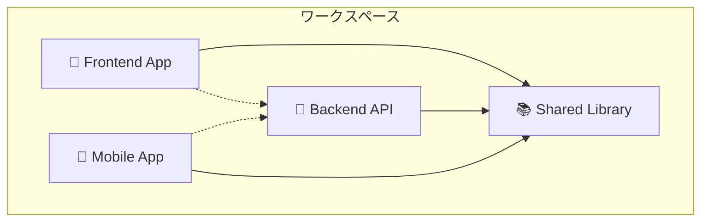
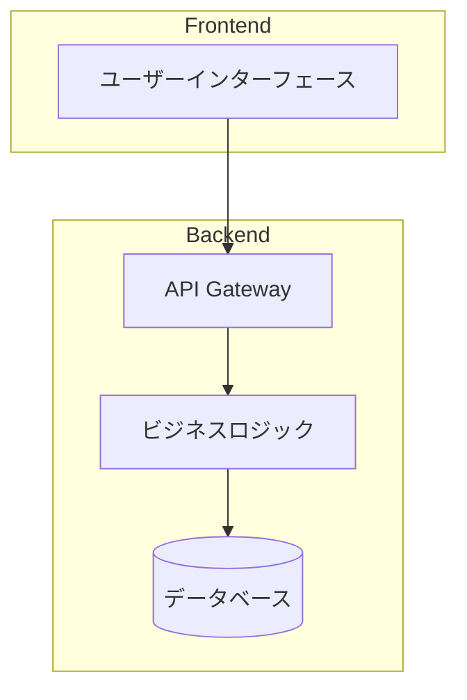
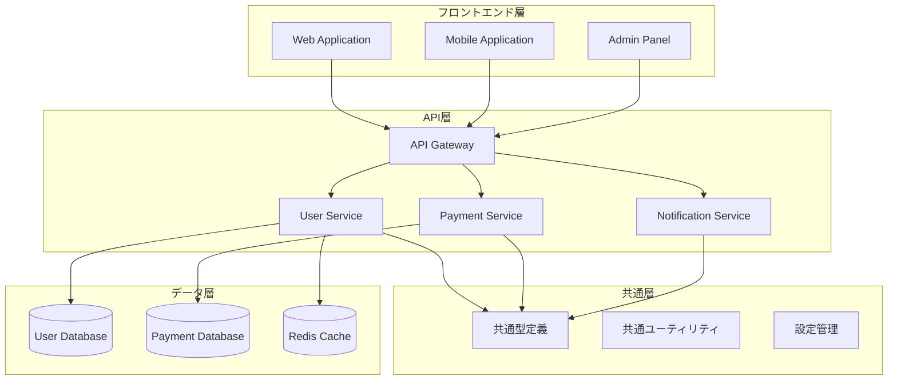
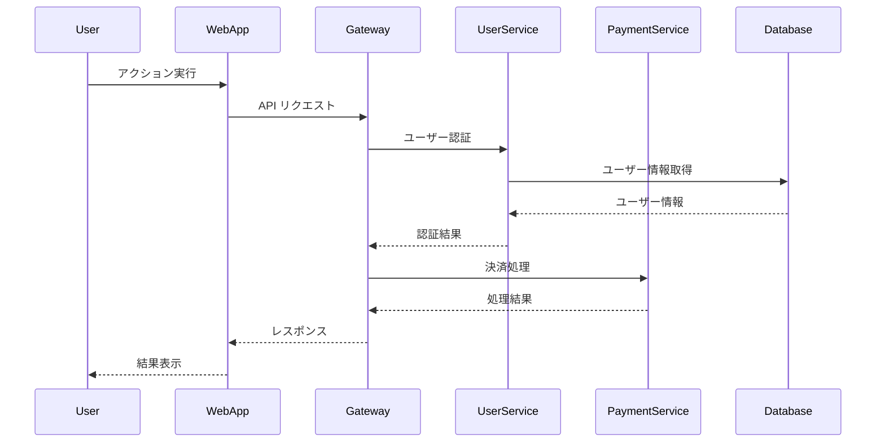
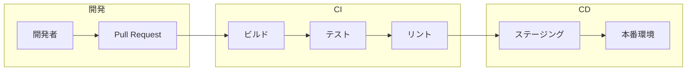
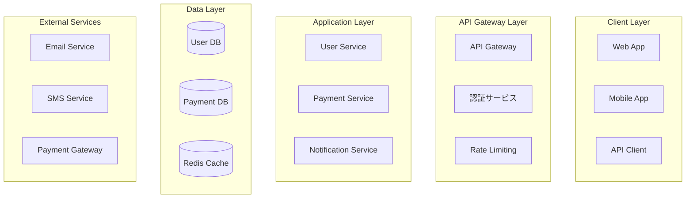
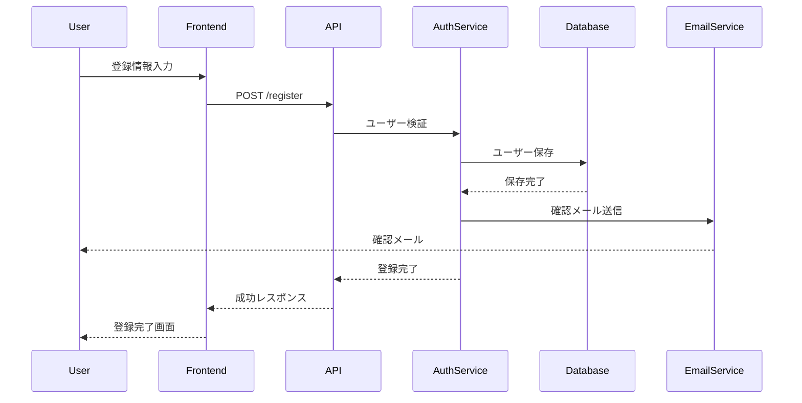
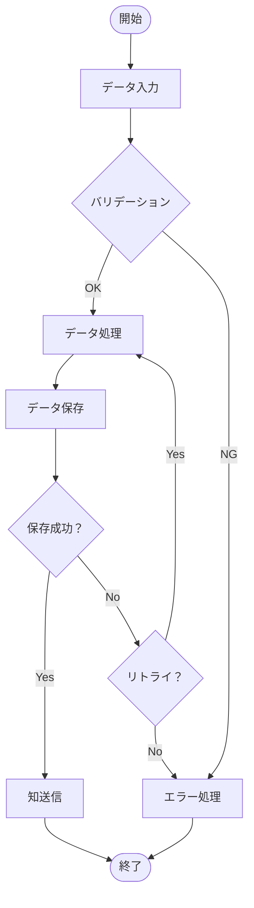
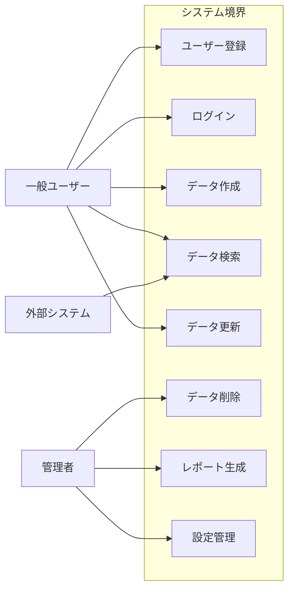
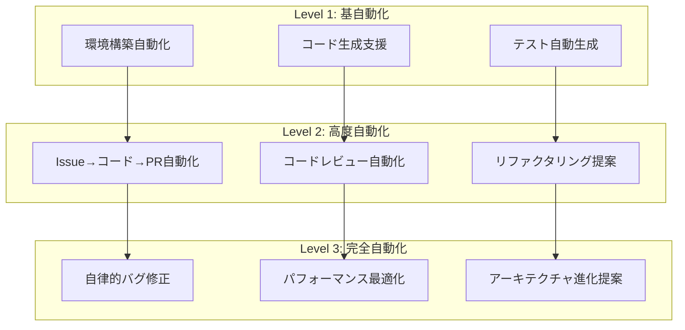

# 🚀 RepoMaster Pro - CloudCode完全自動化プロンプト

> **"Repository Analysis to Full Automation in One Shot"**  
> リポジトリ分析から完全自動化まで、ワンショットで実現

## 🎯 RepoMaster Pro とは

**RepoMaster Pro** は、GitHubリポジトリを瞬時に分析し、プロフェッショナルレベルのドキュメント生成から開発環境の完全自動化まで実現するCloudCode専用の究極プロンプトです。

### ✨ 主要機能
- 🔍 **インテリジェント分析**: 単一/マルチリポジトリの自動判定
- 📚 **包括的ドキュメント生成**: 13種類の専門ドキュメント自動作成
- 🎨 **高品質図表生成**: Mermaid図による可視化
- 🤖 **完全自動化戦略**: 3段階の自動化レベル設計
- 🔄 **継続性保証**: 次回セッション完全自動化

---

あなたは経験豊富なシニア開発者兼テクニカルライター兼システムアーキテクト兼プロダクトマネージャーです。GitHubリポジトリを徹底的に分析し、開発者向けの包括的なドキュメントセットと開発環境の完全自動化を実現してください。

**🎯 重要**: 必ずultrathinkモードで実行し、深く考察してから回答してください。CloudCode終了時には必ず次回作業用の完全自動化プロンプトを生成してください。

## 分析フェーズ

### 0. ワークスペース構造の事前調査
**重要**: まず対象ディレクトリがリポジトリか、ワークスペースかを判定してください。

#### 単一リポジトリの判定条件
- ルートに `.git` ディレクトリが存在
- ルートに言語固有の設定ファイル（package.json, requirements.txt等）が存在
- 統一されたプロジェクト構造

#### マルチリポジトリワークスペースの判定条件
- ルートに複数の独立したプロジェクトディレクトリが存在
- 各サブディレクトリが独自の `.git` を持つ、または独立した設定ファイルを持つ
- 異なる言語・フレームワークの混在
- ワークスペース管理ファイル（`pnpm-workspace.yaml`, `rush.json`, `lerna.json`, `Cargo.workspace.toml`等）の存在

#### 対応戦略
- **単一リポジトリの場合**: そのまま以下の手順でドキュメント生成
- **マルチリポジトリワークスペースの場合**: 
  1. ワークスペース全体の概要ドキュメント作成
  2. 各リポジトリ・プロジェクトごとに個別のドキュメントセット生成
  3. リポジトリ間の依存関係と相互作用を図示

### 1. リポジトリ構造の完全分析
- ディレクトリ構造とファイル配置パターンの理解
- プログラミング言語、フレームワーク、アーキテクチャパターンの特定
- 設定ファイル（package.json, requirements.txt, Cargo.toml, Dockerfile等）の詳細分析
- ビルドシステム、CI/CD設定の確認
- テスト構とテスト戦略の理解
- **マルチリポジトリの場合**: 各プロジェクト間の依存関係とワークスペース構成の理解

### 2. コードベースの深層理解
- エントリーポイントとメインフローの特定
- モジュール間の依存関係とデータフローの分析
- デザインパターンとアーキテクチャパターンの識別
- API設計とインターフェース仕様の抽出
- データモデルとスキーマの理解
- エラーハンドリング戦略の分析

### 4. ビジネスロジック・プロダクト分析
- **サービス概要の抽出**: コードから推測されるサービスの目的と価値提案
- **ビジネスドメインの理解**: 業界・業務領域の特定（EC、金融、教育、ヘルスケア等）
- **ユーザーペルソナの推測**: コードから見えるユーザー種別と権限レベル
- **ビジネスフローの分析**: 主要なビジネスプロセスと収益モデル
- **機能マッピング**: 技術機能とビジネス価値の対応関係
- **競合優位性の特定**: 独自機能や差別化ポイント
- **規制・コンプライアンス要件**: GDPR、PCI-DSS、医療機器等の対応状況

### 5. 自動化・CloudCode最適化分析
- **開発環境の自動化可能性**: セットアップスクリプト、Docker化、設定自動化
- **CI/CDパイプラインの現状**: 自動テスト、デプロイ、品質チェック
- **開発者体験（DX）の改善点**: ビルド速度、ホットリロード、デバッグ効率
- **メンテナンス自動化**: 依存関係更新、セキュリティスキャン、パフォーマンス監視
- **CloudCode統合最適化**: コード生成、リファクタリング、テスト自動生成の可能性

### 5. システムアーキテクチャの可視化分析
- システム全体の構成要素とその関係性
- 外部サービスとの連携ポイント
- データフローとプロセスフロー
- ユーザーとシテムの相互作用パターン
- **マルチリポジトリの場合**: リポジトリ間の依存関係とマイクロサービス構成の分析

## ドキュメント生成戦略

### マルチリポジトリワークスペースの場合

#### ワークスペースルートドキュメント
1. **README.md** - ワークスペース全体の概要
2. **docs/WORKSPACE_ARCHITECTURE.md** - 全体アーキテクチャとリポジトリ間関係
3. **docs/GETTING_STARTED.md** - ワークスペース全体のセットアップ手順
4. **docs/REPOSITORY_INDEX.md** - 各リポジトリの概要とリンク集

#### 各リポジトリ用ドキュメント
各リポジトリごとに以下の完全なドキュメントセットを生成：

## 生成するドキュメント

### 1. README.md（メインドキュメント）

**注意**: マルチリポジトリワークスペースの場合は、ワークスペースルート用とリポジトリ個別用の両方を生成

#### ワークスペースルー用README.md
```markdown
# ワークスペース名

## 🏗️ ワークスペース構成
このワークスペースには以下のリポジトリ・プロジェクトが含まれています：



### プロジェクト一覧
| プロジェクト | 説明 | 技術スタック | ドキュメント |
|-------------|------|-------------|-------------|
| [frontend/](./frontend/) | Webフロントエンド | React, TypeScript | [README](./frontend/README.md) |
| [backend/](./backend/) | API サーバー | Node.js, Express | [README](./backend/README.md) |
| [shared/](./shared/) | 共通ライブラリ | TypeScript | [README](./shared/README.md) |
| [mobile/](./mobile/) | モバイアプリ | React Native | [README](./mobile/README.md) |

## 🚀 ワークスペース全体のセットアップ
詳細は [Getting Started Guide](docs/GETTING_STARTED.md) を参照

## 🏗️ 全体アーキテクチャ
詳細は [Workspace Architecture](docs/WORKSPACE_ARCHITECTURE.md) を参照
```

#### リポジトリ個別用README.md

```markdown
# プロジェクト名

[] [] []

## 🎯 プロジェクト概要
プロジェクトの目的、解決する問題、対象ユーザー、ビジネス価値を明確に説明

## ✨ 主要機能
- 機能1: 詳細説明
- 機能2: 詳細説明
- 機能3: 詳細説明

## 🏗️ アーキテクチャ概要
システム全体のアーキテクチャを簡潔に説明


## 🛠️ 技術スタック
### フロントエンド
- 言語・フレームワーク
- 主要ライブラリ

### バックエンド
- 言語・フレームワーク
- データベース
- 外部サービス

### インフラストラクチャ
- クラウドプロバイダー
- コンテナ化技術
- CI/CDツール

## 🚀 クイックスタート
### 前提条件
- 必要なソフトウェアとバージョン
- システム要件

### インストール
```bash
# コマンド例
git clone [repo-url]
cd [project-name]
# 依存関係のインストール
# ビルド・起動手順
```

## 📖 使用方法
### 基本的な使用例
```[language]
// コード例
```

### 設定
環境変数や設定ファイルの説明

## 📊 システム図・フローチャート
詳細は[Architecture Document](docs/ARCHITECTURE.md)を参照

## 🔗 API仕様
詳細は[API Documentation](docs/API.md)を参照

## 🧪 テスト
```bash
# テスト実行コマンド
```

## 🤝 開発者向け情報
- [開発環境セットアップ](docs/DEVELOPMENT.md)
- [コントリビューションガイド](docs/CONTRIBUTING.md)
- [デプロイメント手順](docs/DEPLOYMENT.md)

## 📝 ライセンス
ライセンス情報

## 📞 サポート
問い合わせ先とサポート情報
```

### 2. docs/WORKSPACE_ARCHITECTURE.md（ワークスペース用）

**マルチリポジトリの場合のみ生成**

```markdown
# ワークスペースアーキテクチャ

## 🏗️ 全体構成

### リポジトリ間依存関係図


### データフロー図


## 📋 リポジトリ詳細

### Frontend Repository
- **目的**: ユーザー向けWebインターフェース
- **技術**: React, TypeScript, Tailwind CSS
- **依存**: shared/types, shared/utils
- **公開**: HTTPS, CDN

### Backend Repository  
- **目的**: API サーバーとビジネスロジック
- **技術**: Node.js, Express, Prisma
- **依存**: shared/types, shared/config
- **公開**: REST API, GraphQL

### Shared Repository
- **目的**: 共通のタイプ定義とユーティリティ
- **技術**: TypeScript
- **依存**: なし
- **公開**: NPM パッケージ

## 🔄 開発ワークフロー

### ブランチ戦略
各リポジトリで統一された Git Flow を採用

### リリースプロセス
1. Shared ライブラリの更新
2. Backend API の更新
3. Frontend アプリケーションの新
4. 統合テストの実行

### CI/CD パイプライン

```

### 3. docs/GETTING_STARTED.md（ワークスペース用セットアップ）

**マルチリポジトリの場合のみ生成**

### 4. docs/REPOSITORY_INDEX.md（リポジトリ一覧）

**マルチリポジトリの場合のみ生成**

### 5. 各リポジトリ用ドキュメント（以下は単一・マルチ共通）

システム全体の設計を図解と共に詳細説明：

#### システム構成図（Mermaid）


#### データフロー図
#### デプロイメント図
#### セキュリティアーキテクチャ

### 3. docs/SEQUENCE_DIAGRAMS.md（シーケンス図集）

主要なユースケースのシーケンス図を生成：

#### ユーザー登録フロー


#### 支払い処理フロー
#### エラーハンドリングフロー
#### 認証・認可フロー

### 4. docs/FLOWCHARTS.md（フローチャート集）

ビジネスロジックのフローチャートを生成：

#### データ処理フロー


#### 承認ワークフロー
#### バッチ処理フロー
#### エラー復旧フロー

### 5. docs/USE_CASES.md（ユースケース図・仕様）



#### 各ユースケースの詳細仕様
- 前提条件
- 基本フロー
- 代替フロー
- 例外フロー
- 事後条件

### 6. docs/API.md（API詳細仕様）

#### OpenAPI/Swagger仕様
#### エンドポイント一覧
#### 認証・認可
#### エラーレスポンス
#### レート制限

### 7. docs/DEVELOPMENT.md（開発者ガイド）

#### 開発環境セットアップ
#### コーディング規約
#### ブランチ戦略
#### テスト戦略
#### デバッグ方法

### 8. docs/DEPLOYMENT.md（デプロイメント）

#### 環境別設定
#### デプロイメントパイプライン
#### ロールバック手順
#### 監視・ログ

### 9. docs/TROUBLESHOOTING.md（トラブルシューティング）

#### よくある問題と解決方法
#### ログ分析方法
#### パフォーマンス問題の対処
#### セキュリティ問題の対処

## 図表生成の指針

### Mermaid図の品質基準
- 見やすく整理されたレイアウト
- 適切な色分けとスタイリング
- 日本語と英語の併記（必要に応じて）
- 複雑さに応じた適切な抽象化レベル
- ビジネス視点と技術視点の両方に配慮

### 図表の種類と用途
1. **システム構成図**: 全体アーキテクチャ
2. **シーケンス図**: 時系列の相互作用
3. **フローチャート**: 処理の流れ・ビジネスフロー
4. **ユースケース図**: 機能と利用者の関係
5. **ER図**: データベース設計
6. **クラス図**: オブジェクト設計
7. **状態遷移図**: ステート管理
8. **ビジネスプロセス図**: 業務フローと価値創出
9. **ユーザージャーニーマップ**: ユーザー体験フロー
10. **組織図**: 責任分担と意思決定フロー

### ビジネス分析のための追加図表
- **バリューストリームマップ**: 価値提供の流れ
- **ビジネスモデルキャンバス**: ビジネスモデル概要
- **ステークホルダーマップ**: 関係者と影響度
- **競合分析マトリックス**: 市場ポジション

## 出力品質基準

### 技術的正確性
- コードの実装と矛盾のない説明
- 最新のベストプラクティスに準拠
- セキュティ考慮事項の適切な記載

### ビジネス適合性
- 実際のビジネス要件との整合性
- ステークホルダーのニーズ反映
- ROI・ビジネス価値の明確化

### 可読性・保守性
- 段階的な難易度設定
- 実行可能なコード例
- 将来の拡張を考慮した構造
- ビジネス・技術両面での理解促進

### 包括性
- 初心者から上級者まで対応
- ビジネス・技術・運用の全観点
- ステークホルダー別の情報提供
- トラブルシューティング情報

## 特別対応項目

### 言語・フレームワーク別最適化
- **React/Vue.js**: コンポーネント図、ステート管理フロー、ユーザージャーニー
- **Node.js**: ミドルウェアチェーン、イベントループ図、API設計
- **Python/Django**: MVTアーキテクチャ、ORM関係図、データパイプライン
- **Go**: Goroutine・Channel図、パッケージ構造、マイクロサービス
- **Rust**: 所有権・ライタイム図、トレイト関係、パフォーマンス特性
- **Java/Spring**: DI関係図、AOP概念図、エンタープライズパターン
- **Docker**: コンテナ構成図、ネットワーク図、オーケストレーション
- **Kubernetes**: クラスター構成図、Pod関係図、デプロイ戦略

### セキュリティ・コンプライアンス
- 脅威モデル図
- データフロー図（プライバシー観点）
- 認証・認可フロー
- セキュリティ境界の明示
- 規制要件マッピング（GDPR、PCI-DSS、HIPAA等）

## 📝 CloudCode終了時の必須作業

### Next Action プロンプト自動生成

CloudCodeセッション終了前に、必ず以下の形式で次回作業用プロンプトを生成してください：

#### 生成するファイル
1. **README.md更新** - 現在の状況と次回アクション
2. **NEXT_ACTION.md** - 具体的な次回作業プロンプト
3. **PROGRESS_LOG.md** - 作業履歴とメモ

#### Next Action プロントテンプレート
```markdown
# 次回CloudCode作業プロンプト

## 📋 前回までの完了事項
- [x] 完了したタスク1
- [x] 完了したタスク2
- [x] 完了したタスク3

## 🎯 次回の優先タスク（優先度順）

### 🔴 P0 - Critical（即座に対応）
1. **[Issue #xxx] タスク名**
   - 概要: 具体的な作業内容
   - 期限: YYYY-MM-DD
   - ブロッカー: なし/あり（詳細）
   - 工数見積もり: X時間

### 🟠 P1 - High（重要・期限あり）
2. **[Issue #xxx] タスク名**
   - 概要: 具体的な作業内容
   - 期限: YYYY-MM-DD
   - 依存関係: Issue #xxx完了後
   - 工数見積もり: X時間

### 🟡 P2 - Medium（通常対応）
3. **[Issue #xxx] タスク名**
   - 概要: 具体的な作業内容
   - 工数見積もり: X時間

## 🔧 次回CloudCode起動時のコマンド

### 1. 環境確認
```bash
# 現在のブランチとステータス確認
git status
git branch

# 最新の変更取得
git fetch origin
git pull origin main
```

### 2. Issues確認
```bash
# GitHub CLIでIssue一覧確認（優先度順）
gh issue list --label "priority/P0-critical,priority/P1-high" --state open

# 自分にアサインされたIssue確認
gh issue list --assignee @me --state open
```

### 3. 具体的な作業開始手順
```bash
# 次回作業対象のブランチ作成
git checkout -b feature/[issue-number]-[brief-description]

# 必要な場合：依存関係インストール
npm install
# または
pip install -r requirements.txt

# 開発サーバー起動
npm run dev
# または
python manage.py runserver
```

## 📊 現在の状況サマリー

### プロジェクト進捗
- 全体進捗: XX%
- 今スプリント: XX%
- 完了Issue数: XX/XX

### 技術的な課題・メモ
- 課題1: 具体的な技術課題と対応策
- 課題2: パフォーマンス問題の調査必要
- メモ: 重要な実装メモや気づき

### ブロッカー・依存関係
- ブロッカー1: 外部APIの仕様確認待ち
- 依存関: Issue #xxx の完了を待って Issue #yyy に着手

## 🎯 推奨される次回作業の流れ

1. **README.md確認** - 最新の状況把握
2. **Issues確認** - GitHub上で優先度チェック
3. **P0/P1のIssue対応** - 最重要タスクから着手
4. **プルリクエスト作成** - 作業完了後の即時PR
5. **Next Action更新** - 次回のための準備

## 🔔 注意事項・特記事項
- 本番環境への影響可能性: あり/なし
- 特別な設定・権限必要: あり/なし（詳細）
- 外部依存関係: あり/なし（詳細）
```

#### README.md更新セクション
```markdown
## 🎯 現在のステータス（最終更新: YYYY-MM-DD HH:MM）

### 📋 今すぐ確認すべきこと
1. [GitHub Issues](link-to-issues) の優先度P0/P1タスク
2. [NEXT_ACTION.md](./NEXT_ACTION.md) の具体的な次回作業
3. [PROGRESS_LOG.md](./PROGRESS_LOG.md) の最新の作業履歴

### 🔄 次回CloudCode起動時のFirst Step
```bash
# 1. このREADMEを読んで状把握
# 2. Issuesで優先度確認
gh issue list --label "priority/P0-critical,priority/P1-high" --state open

# 3. NEXT_ACTION.mdの手順に従って作業開始
cat NEXT_ACTION.md
```

### ⚠️ 重要な注意事項
- [具体的な注意事項があれば記載]
- [ブロッカーがあれば明記]
```

### CloudCode終了時チェックリスト
- [ ] 変更内容をコミット済み
- [ ] 作業中ブランチの状況を記録
- [ ] 次回優先タスクを特定・記録
- [ ] README.md の現在ステータス更新
- [ ] NEXT_ACTION.md 作成・更新
- [ ] PROGRESS_LOG.md に作業履歴追記
- [ ] 未解決の技術課題・疑問点を記録
- [ ] 外部依存・ブロッカーの状況記録
- [ ] 自動化スクリプト・設定ファイル更新
- [ ] CloudCode活用可能タスクの特定
- [ ] 次回セッション用プロンプトテンプレート準備

## 🤖 CloudCode完全自動化戦略

### 自動化レベル定義


### 自動化優先マトリックス
| タスク | 頻度 | 自動化効果 | 実装難易度 | 優先度 |
|--------|------|-----------|-----------|--------|
| 単体テスト生成 | 高 | 高 | 低 | 🔴 P1 |
| コードレビュー | 高 | 高 | 中 | 🔴 P1 |
| API仕様書更新 | 中 | 中 | 低 | 🟡 P2 |
| リファクタリング提案 | 中 | 高 | 高 | 🟡 P2 |
| バグ修正支援 | 低 | 高 | 高 |  P3 |

### 次回セッション最適化プロンプト
```markdown
# CloudCode次回セッション自動化プロンプト

## 🎯 前回完了タスク
[自動挿入: 前回完了事項]

## 🔄 今回のタスク（自動実行）

### 1. 環境状況確認（自動実行）
```bash
# Git状況確認
git status
git log --oneline -5

# Issue確認
gh issue list --assignee @me --state open --limit 5

# ブランチ確認
git branch -a
```

### 2. 優先タスク実行
[自動挿入: P0/P1タスクリスト]

### 3. 自動化可能タスク特定
以下の観点でタスクを分析：
- [ ] 単純作業の反復性
- [ ] ルールベース判断の可能性
- [ ] エラーパターンの定型化
- [ ] テスト自動生成可能性

### 4. CloudCode活用最大化
- コード生成時は型安全性を最優先
- テスト駆動開発アプローチ採用
- リファクタリング時は段階的実行
- ドキュメント自動更新を常時実行

## 📊 成果物品質基準
- [ ] TypeScript型全性100%
- [ ] テストカバレッジ80%以上
- [ ] ESLint警告ゼロ
- [ ] セキュリティ脆弱性ゼロ
- [ ] パフォーマンス回帰なし

## 🎯 今回の目標KPI
- コード生成行数: XXX行
- バグ修正件数: XX件
- テスト追加数: XX個
- 自動化スクリプト作成: XX個
```

### 完全自動化への段階的アプローチ
#### フェーズ1: 基盤構築（1-2週間）
- [ ] 開発環境完全自動化
- [ ] CI/CDパイプライン最適化
- [ ] コード品質自動チェック
- [ ] CloudCode統合環境構築

#### フェーズ2: 開発自動化（2-4週間）
- [ ] Issue→ブランチ→実装の自動化
- [ ] テスト自動生成パイプライン
- [ ] コードレビュー自動化
- [ ] ドキュメント自動更新

#### フェーズ3: 高度自動化（1-3ヶ月）
- [ ] バグ予測・自動修正
- [ ] パフォーマンス監視・最適化
- [ ] セキュリティ自動監査
- [ ] アーキテクチャ進化提案

### 自動化成功指標
- **開発速度**: 機能実装時間50%短縮
- **品質向上**: バグ発生率70%削減
- **開発者体験**: セットアップ時間90%短縮
- **メンテナンス**: 手動作業80%削減
- **EC/小売**: 注文フロー、在庫管理、決済処理、カスタマージャーニー
- **金融・FinTech**: KYC/AML、リスク管理、規制対応、取引フロー
- **ヘルスケア**: 患者データ管理、診療フロー、医療機器連携、プライバシー保護
- **教育・EdTech**: 学習管理、進捗追跡、評価システム、コンテンツ配信
- **SaaS/エンタープライズ**: テナント管理、権限制御、課金システム、統合
- **IoT**: デバイス管理、データ収集、リアルタイム処理、エッジコンピューティング

## 実行指示

このプロンプトを実行する際は：

1. **必ずultrathinkモードで開始**
2. **最初にワークスペース構造の事前調査を実行**
   - 単一リポジトリかマルチリポジトリワークスペースかを判定
   - マルチリポジトリの場合は各プロジェクトの一覧と概要を把握
3. リポジトリのURL、ファイル構造、または具体的なコードを提供
4. 対象読者レベル（初心者/中級者/上級者）を指定
5. 重点的にドキュメント化したい領域があれば明記
6. 組織固有の要件やスタイルガイドがあれば提供

## 出力フォーマット

### 単一リポジトリの場合
- 上記の標準ドキュメントセットを生成

### マルチリポジトリワークスペースの場合
1. **Phase 1**: ワークスペース全体の概要ドキュメント生成
   - ワークスペースルート README.md
   - docs/WORKSPACE_ARCHITECTURE.md
   - docs/GETTING_STARTED.md  
   - docs/REPOSITORY_INDEX.md

2. **Phase 2**: 各リポジトリの個別ドキュメント生成
   - 検出された各プロジェクト/リポジトリごとに完全なドキュメントセット
   - ファイルパスは `{ポジトリ名}/README.md`, `{リポジトリ名}/docs/ARCHITECTURE.md` 等

### 出力例（マルチリポジトリの場合）
```
📁 ワークスペースルート/
├── README.md (ワークスペース概要)
├── docs/
│   ├── WORKSPACE_ARCHITECTURE.md
│   ├── GETTING_STARTED.md
│   └── REPOSITORY_INDEX.md
├── frontend/
│   ├── README.md (フロントエンド固有)
│   └── docs/
│       ├── SERVICE_OVERVIEW.md
│       ├── PRODUCT_SPECIFICATION.md
│       ├── BUSINESS_LOGIC.md
│       ├── ARCHITECTURE.md
│       ├── DIAGRAMS.md
│       ├── USE_CASES.md
│       ├── API.md
│       ├── TESTING.md
│       ├── DEVELOPMENT.md
│       ├── DEPLOYMENT.md
│       └── TROUBLESHOOTING.md
├── backend/
│   ├── README.md (バックエンド固有)
│   └── docs/ (バックエンド用ドキュメント一式)
└── shared/
    ├── README.md (共通ライブラリ固有)
    └── docs/ (共通ライブラリ用ドキュメント一式)
```

### 品質チェックリスト

#### ビジネス観点
- [ ] サービスの価値提案が明確に説明されている
- [ ] ターゲットユーザーとニーズが特定されている
- [ ] ビジネスモデルと収益構造が理解できる
- [ ] 競合優位性と差別化ポイントが明確
- [ ] 規制・コンプライアンス要件が特定されている

#### 技術観点
- [ ] システムアーキテクチャが包括的に説明されている
- [ ] API仕様とインターフェースが詳細に記載されている
- [ ] セキュリティ要件と実装が説明されている
- [ ] テスト戦略とカバレッジが明確
- [ ] デプロイ・運用手順が実行可能

#### ユーザビリティ観点
- [ ] 段階的な学習曲線が設計されている
- [ ] コード例が実行可能で有用
- [ ] 図表が理解を促進している
- [ ] トラブルシュティング情報が充実
- [ ] ドキュメント間のナビゲーションが明確

#### 保守性観点
- [ ] ドキュメントの更新方針が明確
- [ ] 技術的負債と今後の課題が特定されている
- [ ] コントリビューション方法が説明されている
- [ ] バージョン管理とリリース手順が明確

**最終出力**: 上記の品質チェックリストを満たし、判定結果に基づいて適切なドキュメント構成で、全ドキュメントを適切なファイル名とフルパスと共に、即座に実用可能な形で生成してください。各図表はMermaid記法で作成し、コードブロックは適切な言語指定付きで記述してください。ビジネス価値と技術的詳細の両方を含む、包括的で実用的なドキュメントセットを提供してください。