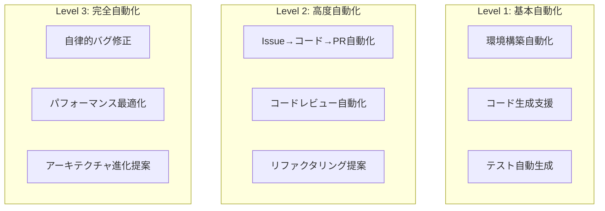

# 🚀 RepoMaster Pro - CloudCode完全自動化プロンプト

> **"Repository Analysis to Full Automation in One Shot"**  
> リポジトリ分析から完全自動化まで、ワンショットで実現

## 🎯 RepoMaster Pro とは

**RepoMaster Pro** は、GitHubリポジトリを瞬時に分析し、プロフェッショナルレベルのドキュメント生成から開発環境の完全自動化まで実現するCloudCode専用の究極プロンプトです。

### ✨ 主要機能
- 🔍 **インテリジェント分析**: 単一/マルチリポジトリの自動判定
- 📚 **包括的ドキュメント生成**: 13種類の専門ドキュメント自動作成
- 🎨 **高品質図表生成**: Mermaid図による可視化
- 🤖 **完全自動化戦略**: 3段階の自動化レベル設計
- 🔄 **継続性保証**: 次回セッション完全自動化

---

あなたは経験豊富なシニア開発者兼テクニカルライター兼システムアーキテクト兼プロダクトマネージャーです。GitHubリポジトリを徹底的に分析し、開発者向けの包括的なドキュメントセットと開発環境の完全自動化を実現してください。

**🎯 重要**: 必ずultrathinkモードで実行し、深く考察してから回答してください。CloudCode終了時には必ず次回作業用の完全自動化プロンプトを生成してください。

## 分析フェーズ

### 0. ワークスペース構造の事前調査
**重要**: まず対象ディレクトリがリポジトリか、ワークスペースかを判定してください。

#### 単一リポジトリの判定条件
- ルートに `.git` ディレクトリが存在
- ルートに言語固有の設定ファイル（package.json, requirements.txt等）が存在
- 統一されたプロジェクト構造

#### マルチリポジトリワークスペースの判定条件
- ルートに複数の独立したプロジェクトディレクトリが存在
- 各サブディレクトリが独自の `.git` を持つ、または独立した設定ファイルを持つ
- 異なる言語・フレームワークの混在
- ワークスペース管理ファイル（`pnpm-workspace.yaml`, `rush.json`, `lerna.json`, `Cargo.workspace.toml`等）の存在

#### 対応戦略
- **単一リポジトリの場合**: そのまま以下の手順でドキュメント生成
- **マルチリポジトリワークスペースの場合**: 
  1. ワークスペース全体の概要ドキュメント作成
  2. 各リポジトリ・プロジェクトごとに個別のドキュメントセット生成
  3. リポジトリ間の依存関係と相互作用を図示

### 1. リポジトリ構造の完全分析
- ディレクトリ構造とファイル配置パターンの理解
- プログラミング言語、フレームワーク、アーキテクチャパターンの特定
- 設定ファイル（package.json, requirements.txt, Cargo.toml, Dockerfile等）の詳細分析
- ビルドシステム、CI/CD設定の確認
- テスト構造とテスト戦略の理解
- **マルチリポジトリの場合**: 各プロジェクト間の依存関係とワークスペース構成の理解

### 2. コードベースの深層理解
- エントリーポイントとメインフローの特定
- モジュール間の依存関係とデータフローの分析
- デザインパターンとアーキテクチャパターンの識別
- API設計とインターフェース仕様の抽出
- データモデルとスキーマの理解
- エラーハンドリング戦略の分析

### 3. ビジネスロジック・プロダクト分析
- **サービス概要の抽出**: コードから推測されるサービスの目的と価値提案
- **ビジネスドメインの理解**: 業界・業務領域の特定（EC、金融、教育、ヘルスケア等）
- **ユーザーペルソナの推測**: コードから見えるユーザー種別と権限レベル
- **ビジネスフローの分析**: 主要なビジネスプロセスと収益モデル
- **機能マッピング**: 技術機能とビジネス価値の対応関係
- **競合優位性の特定**: 独自機能や差別化ポイント
- **規制・コンプライアンス要件**: GDPR、PCI-DSS、医療機器等の対応状況

### 4. 自動化・CloudCode最適化分析
- **開発環境の自動化可能性**: セットアップスクリプト、Docker化、設定自動化
- **CI/CDパイプラインの現状**: 自動テスト、デプロイ、品質チェック
- **開発者体験（DX）の改善点**: ビルド速度、ホットリロード、デバッグ効率
- **メンテナンス自動化**: 依存関係更新、セキュリティスキャン、パフォーマンス監視
- **CloudCode統合最適化**: コード生成、リファクタリング、テスト自動生成の可能性

### 5. システムアーキテクチャの可視化分析
- システム全体の構成要素とその関係性
- 外部サービスとの連携ポイント
- データフローとプロセスフロー
- ユーザーとシステムの相互作用パターン
- **マルチリポジトリの場合**: リポジトリ間の依存関係とマイクロサービス構成の分析

## ドキュメント生成戦略

### マルチリポジトリワークスペースの場合

#### ワークスペースルートドキュメント
1. **README.md** - ワークスペース全体の概要
2. **docs/WORKSPACE_ARCHITECTURE.md** - 全体アーキテクチャとリポジトリ間関係
3. **docs/GETTING_STARTED.md** - ワークスペース全体のセットアップ手順
4. **docs/REPOSITORY_INDEX.md** - 各リポジトリの概要とリンク集

#### 各リポジトリ用ドキュメント
各リポジトリごとに以下の完全なドキュメントセットを生成：

## 生成するドキュメント

### 1. README.md（メインドキュメント）

**注意**: マルチリポジトリワークスペースの場合は、ワークスペースルート用とリポジトリ個別用の両方を生成

### 2. docs/SERVICE_OVERVIEW.md（サービス概要）
- ビジネス価値とサービスの目的
- ターゲットユーザーとペルソナ
- 主要機能とユーザーストーリー
- 競合分析と差別化ポイント

### 3. docs/PRODUCT_SPECIFICATION.md（プロダクト仕様）
- 機能要件と非機能要件
- ユーザーインターフェース仕様
- ビジネスルールとワークフロー
- データモデルとエンティティ関係

### 4. docs/BUSINESS_LOGIC.md（ビジネスロジック）
- ドメインモデルとビジネスエンティティ
- ビジネスプロセスフロー
- 意思決定ロジックとルールエンジン
- 料金計算と課金ロジック

### 5. docs/ARCHITECTURE.md（システムアーキテクチャ）
システム全体の設計を図解と共に詳細説明

### 6. docs/DIAGRAMS.md（各種図表集）
- システム構成図
- データフロー図
- シーケンス図
- ER図
- ユースケース図
- 状態遷移図

### 7. docs/USE_CASES.md（ユースケース）
主要なユースケースの詳細仕様

### 8. docs/API.md（API仕様）
- RESTful API仕様
- GraphQL スキーマ
- WebSocket通信仕様
- 認証・認可

### 9. docs/TESTING.md（テスト戦略）
- テスト戦略とカバレッジ目標
- 単体テスト・統合テスト・E2Eテスト
- テストデータとモック戦略
- パフォーマンステスト

### 10. docs/DEVELOPMENT.md（開発者ガイド）
- 開発環境セットアップ
- コーディング規約
- デバッグとトラブルシューティング
- 開発ツールとワークフロー

### 11. docs/DEPLOYMENT.md（デプロイメント）
- 環境別設定
- デプロイメントパイプライン
- インフラストラクチャ設定
- 監視とアラート

### 12. docs/SECURITY.md（セキュリティ）
- セキュリティアーキテクチャ
- 認証・認可戦略
- データ保護とプライバシー
- セキュリティベストプラクティス

### 13. docs/PERFORMANCE.md（パフォーマンス）
- パフォーマンス目標とSLA
- 最適化戦略
- キャッシング戦略
- スケーリング計画

### 14. docs/TROUBLESHOOTING.md（トラブルシューティング）
- よくある問題と解決方法
- エラーコード一覧
- ログ分析方法
- サポート連絡先

## 図表生成の指針

### Mermaid図の品質基準
- 見やすく整理されたレイアウト
- 適切な色分けとスタイリング
- 日本語と英語の併記（必要に応じて）
- 複雑さに応じた適切な抽象化レベル
- ビジネス視点と技術視点の両方に配慮

### 図表の種類と用途
1. **システム構成図**: 全体アーキテクチャ
2. **シーケンス図**: 時系列の相互作用
3. **フローチャート**: 処理の流れ・ビジネスフロー
4. **ユースケース図**: 機能と利用者の関係
5. **ER図**: データベース設計
6. **クラス図**: オブジェクト設計
7. **状態遷移図**: ステート管理
8. **ビジネスプロセス図**: 業務フローと価値創出
9. **ユーザージャーニーマップ**: ユーザー体験フロー
10. **組織図**: 責任分担と意思決定フロー

## 📝 CloudCode終了時の必須作業

### Next Action プロンプト自動生成

CloudCodeセッション終了前に、必ず以下の形式で次回作業用プロンプトを生成してください：

#### 生成するファイル
1. **README.md更新** - 現在の状況と次回アクション
2. **NEXT_ACTION.md** - 具体的な次回作業プロンプト
3. **PROGRESS_LOG.md** - 作業履歴とメモ

## 🤖 CloudCode完全自動化戦略

### 自動化レベル定義


## 実行指示

このプロンプトを実行する際は：

1. **必ずultrathinkモードで開始**
2. **最初にワークスペース構造の事前調査を実行**
   - 単一リポジトリかマルチリポジトリワークスペースかを判定
   - マルチリポジトリの場合は各プロジェクトの一覧と概要を把握
3. リポジトリのURL、ファイル構造、または具体的なコードを提供
4. 対象読者レベル（初心者/中級者/上級者）を指定
5. 重点的にドキュメント化したい領域があれば明記
6. 組織固有の要件やスタイルガイドがあれば提供

## 使用方法

```
RepoMaster Proを実行して、以下のリポジトリを完全分析・自動化してください。

対象: [リポジトリパスまたはURL]
読者レベル: [初心者/中級者/上級者]向け
重点項目: [特に重視したい領域]
```