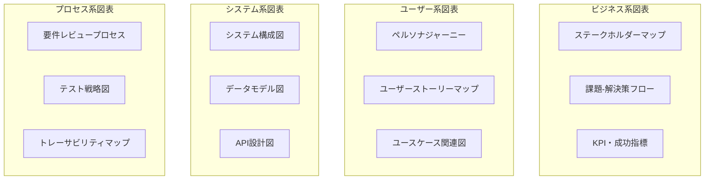
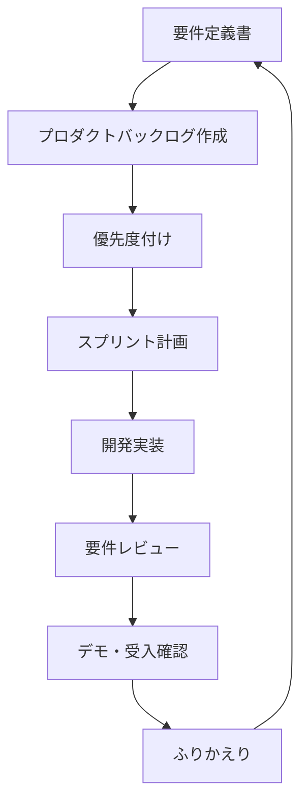

# 📖 プロダクト要件定義 Master Pro 使い方ガイド

> **"From Product Concept to Implementation-Ready Requirements in One Shot"**  
> プロダクトコンセプトから実装可能要件まで、ワンショットで完全定義

## 🎯 プロダクト要件定義 Master Pro とは

**プロダクト要件定義 Master Pro** は、プロダクトのアイデアやコンセプトを受け取り、開発チームが即座に実装に着手できる包括的な要件定義ドキュメントセットを自動生成するCloudCode専用プロンプトです。

### ✨ 何ができるの？
- 🎯 **完全要件網羅**: ビジネス・ユーザー・機能・非機能要件の体系的定義
- 📊 **実装指向設計**: 開発チームが迷わない詳細仕様書生成
- 🔄 **トレーサビリティ確保**: 要件間の関係性と追跡可能性
- 🧪 **テスト要件統合**: 受入基準とテスト仕様の同時生成
- 📈 **変更管理対応**: 要件変更プロセス影響分析
- 🎨 **可視化重視**: Mermaid図による要件関係の明確化
- ⚖️ **品質保証**: SMART原則準拠の高品質要件定義

## 🚀 基本的な使い方

### Step 1: プロンプト準備
[プロダクト要件定義 Master Pro メインプロンプト](./prompt.md)を使用

### Step 2: プロダクト情報の入力
以下の形式で情報を追加：

```markdown
プロダクト要件定義 Master Proで「[プロダクト名]」の要件定義を作成してください。

【基本情報】
コンセプト: [プロダクトの目的・背景]
対象ユーザー: [ユーザー層・規模]
主要機能: [核となる機能]
解決する課題: [具体的な課題・ペインポイント]

【技術・制約情報】
技術制約: [技術的な制約・要件]
予算・期間: [概算予算・開発期間]
開発手法: [アジャイル/ウォーターフォール等]
チーム規模: [開発チーム人数・スキル]

【特別要件】
業界要件: [業界固有規制・要件]
セキュリティ: [セキュリティ・プライバシー要件]
国際化: [多言語・地域対応]
```

### Step 3: CloudCode での実行
1. **CloudCodeを起動**
2. **ultrathinkモード確認**
3. **メインプロンプト + プロダクト情報を実行**

## 🎨 CloudCode での使い方詳細

### 💻 CloudCode実行手順

1. **プロンプト準備**
```bash
# メインプロンプトを全てコピー
# プロダクト情報を追記して実行
```

2. **実行例**
```
プロダクト要件定義 Master Proで「社内勤怠管理システム」の要件定義を作成してください。

【基本情報】
コンセプト: 従来の紙ベース勤怠をデジタル化、リモートワーク対応
対象ユーザー: 全社員(200名)、人事担当(5名)、管理職(15名)
主要機能: 勤怠打刻・休暇申請・勤怠確認・給与連携・レポート生成
解決する課題: 紙管理の非効率性、リモートワーク対応、集計作業の手間

【技術・制約情報】
技術制約: 既存Active Directory連携必須、モバイル対応必須
予算・期間: 1500万円、開発期間8ヶ月
開発手法: アジャイル開発、2週間スプリント
チーム規模: 8名（PM1名、エンジニア5名、デザイナー1名、QA1名）

【特別要件】
業界要件: 労働基準法準拠、36協定対応、就業規則との整合性
セキュリティ: 個人情報保護法対応、アクセス制御、監査ログ
国際化: 当面は日本語のみ、将来的に英語対応予定
```

3. **生成結果確認**
- 10種類の要件定義書が自動生成
- 各ドキュメントの整合性チェック
- 不足部分があれば追加質問

## 📋 生成される成果物

### 📊 10種類の要件定義ドキュメント

| ドキュメント | 内容 | 主な活用者 |
|-------------|------|-----------|
| **プロダクト概要書** | ビジネス価値・KPI・ステークホルダー | 経営陣・プロダクトオーナー |
| **ユーザー要件定義書** | ペルソナ・ジャーニー・ストーリー | PM・UXデザイナー |
| **機能要件定義書** | 詳細仕様・受入基準・優先度 | 開発チーム・QA |
| **非機能要件定義書** | 性能・セキュリティ・運用要件 | アーキテクト・インフラ |
| **システム設計要件書** | アーキテクチャ・技術選定 | テックリード・エンジニア |
| **インターフェース仕様書** | UI/UX・API・外部連携 | フロントエンド・バックエンド |
| **データ要件定義書** | データモデル・ライフサイクル | データエンジニア・DBA |
| **テスト要件・受入基準書** | テスト戦略・検証方法 | QAチーム・テストエンジニア |
| **運用・保守要件書** | 監視・メンテナンス・障害対応 | SRE・運用チーム |
| **要件トレーサビリティマトリックス** | 要件関係性・追跡管理 | PM・QA・開発リーダー |

### 🎨 豊富な図表・可視化



## 🎯 活用シーン・対象者

### 📈 活用シーン

#### 🚀 新規プロダクト開発
- **アイデア検証**: コンセプトの要件化・実現可能性確認
- **MVP定義**: 最小実証版の要件明確化
- **開発着手**: 実装チームへの明確な指示書
- **ステークホルダー合意**: 関係者間の認識統一

#### 🏢 既存システム刷新
- **現状分析**: As-Is要件の整理
- **To-Be設計**: 新システムの要件定義
- **移行計画**: データ・機能移行の要件
- **段階的リリース**: フェーズ別要件の明確化

#### 📋 RFP・提案対応
- **要件整理**: 顧客要求の構造化
- **提案書作成**: 技術提案の根拠資料
- **工数見積**: 開発規模の算定根拠
- **リスク分析**: 技術・ビジネスリスクの特定

### 👥 対象者別活用方法

| 対象者 | 主な活用目的 | 重点ドキュメント |
|--------|-------------|-----------------|
| **プロダクトマネージャー** | 要件整理・優先度決定 | プロダクト概要・ユーザー要件・トレーサビリティ |
| **エンジニアリングマネージャー** | 技術選定・アーキテクチャ設計 | システム設計・非機能要件・インターフェース仕様 |
| **開発エンジニア** | 実装仕様・受入基準確認 | 機能要件・インターフェース・データ要件 |
| **QAエンジニア** | テスト計画・品質基準 | テスト要件・機能要件・受入基準 |
| **UX/UIデザイナー** | ユーザー体験設計 | ユーザー要件・インターフェース仕様 |
| **ビジネスオーナー** | ビジネス価値・ROI確認 | プロダクト概要・ビジネス要件 |

## 💡 効果的な使い方のコツ

### 🎯 入力情報のコツ

#### ✅ Good（具体的・詳細）
```
【基本情報】
コンセプト: 中小企業(50-200名)向けの勤怠管理SaaS。
         従来のExcel管理から脱却し、労働基準法準拠の
         自動集計・アラート機能で人事業務を50%効率化

対象ユーザー: 
- 一般社員: 日々の勤怠入力・休暇申請
- 管理職: チーム勤怠確認・承認業務  
- 人事担当: 全社勤怠管理・給与計算・法令チェック

主要機能:
- 勤怠打刻: Web/スマホ/ICカード対応
- 休暇管理: 申請・承認ワークフロー・残日数管理
- 集計・分析: 自動集計・法令チェック・アラート
- 連携: 給与システム・人事システムとのAPI連携
```

#### ❌ Bad（抽象的・曖昧）
```
コンセプト: 勤怠管理システム
対象ユーザー: 会社員
主要機能: 勤怠管理
```

### 📊 制約条件の明確化

#### 効果的な制約指定
```
【技術・制約情報】
技術制約:
- 既存AD(Active Directory)との認証連携必須
- 既存給与システム(XX社製)とのAPI連携必須
- クラウド環境必須(AWS/Azure指定)
- モバイル対応必須(iOS/Android ネイティブアプリ)

予算・期間:
- 開発予算: 1500万円(システム構築1200万円 + 運用300万円/年)
- 開発期間: 8ヶ月(要件定義1ヶ月 + 開発6ヶ月 + 導入1ヶ月)
- 導入時期: 2024年4月(新年度開始に合わせて)

チーム構成:
- PM: 1名(要件管理・プロジェクト推進)
- フロントエンド: 2名(React/TypeScript経験者)
- バクエンド: 2名(Node.js/Python経験者)
- インフラ: 1名(AWS/DevOps経験者)
- QA: 1名(自動テスト・セキュリティテスト)
- UX/UI: 1名(B2B SaaS デザイン経験者)
```

### 🏢 業界特化要件の指定

#### 業界別特化例
```
【特別要件 - 金融業界】
業界要件:
- 金融庁規制対応(システムリスク管理基準)
- SOX法対応(内部統制・監査証跡)
- 個人情報保護法・改正個情法対応
- BCP(事業継続計画)対応・災害対策

セキュリティ:
- 金融等級セキュリティ要件
- 多要素認証・特権アクセス管理
- 暗号化(保存時・転送時)
- 侵入検知・不正利用監視

【特別要件 - 医療業界】  
業界要件:
- 医療法・医師法準拠
- 個人情報保護法(医療分野ガイドライン)
- 医療情報システム安全管理ガイドライン
- 電子カルテシステム連携

セキュリティ:
- HIPAA準拠(米国展開時)
- 患者データ匿名化・仮名化
- アクセス制御・操作ログ
- データ保持期間管理
```

## 📈 成果物の活用方法

### 🎤 ステークホルダー向けプレゼン

1. **経営陣向け**
   - プロダクト概要書 → ビジネス価値・ROI説明
   - 要件トレーサビリティ → リスク・影響分析
   - 運用要件書 → 継続的なコスト・体制

2. **開発チーム向け**
   - システム設計要件書 → 技術選定・アーキテクチャ
   - 機能要件定義書 → 実装仕様・受入基準
   - インターフェース仕様書 → API・UI設計

3. **品質保証向け**
   - テスト要件書 → テスト戦略・計画
   - 機能要件書 → 受入基準・検証観点
   - 非機能要件書 → 性能・セキュリティテスト

### 🛠️ 開発プロジェクトでの活用

#### スプリント計画


#### 受入テスト実行
1. **機能要件定義書** → テストケース作成
2. **受入基準** → 合格判定基準
3. **ユーザーストーリー** → ユーザー受入テスト
4. **非機能要件** → 性能・セキュリティテスト

### 📊 プロジェクト管理での活用

#### 進捗管理
- **要件実装率**: 実装完了 / 全要件数
- **テスト完了率**: テスト完了 / 全テストケース数
- **受入完了率**: 受入完了 / 全ユーザーストーリー数
- **品質指標**: 欠陥密度・修正率・再発率

#### 変更管理
- **影響分析**: トレーサビリティマトリックスで影響範囲特定
- **工数見積**: 要件変更による追加工数算定
- **リスク評価**: 変更による技術・スケジュールリスク
- **承認プロセス**: ステークホルダー合意・意思決定

## ⚠️ 注意点・制限事項

### 🔍 生成結果の活用について
- **ベースライン活用**: 生成内容を起点として、プロジェクト固有にカスタマイズ
- **専門家レビュー**: 法務・セキュリティ要件は必ず専門家の確認を実施
- **継続的更新**: プロジェクト進行に合わせて要件定義を継続的に更新

### 📋 品質向上のポイント
- **具体性重視**: 抽象的な表現ではなく、具体的で測定可能な要件記述
- **ステークホルダー確認**: 生成された要件を関係者と必ずレビュー
- **実装チェック**: 開発チームによる実現可能性・技術的妥当性の確認

### 🎯 継続的改善
- **フィードバック収集**: 実装・テスト段階での要件の妥当性評価
- **プロセス改善**: 要件定義プロセスの継続的な改善
- **ナレッジ蓄積**: プロジェクト経験を次回の要件定義に活用

## 🤝 サポート・コミュニティ

### 📚 関連リソース
- [プロダクト要件定義 Master Pro メインプロンプト](./prompt.md)
- [実装サンプル・テンプレート集](./examples/)
- [業界別カスタマイズガイド](./industry-guides/)
- [開発プロンプト集リポジトリ](../../../)

### 💬 質問・フィードバック
- GitHub Issues での質問・改善要求
- 実際の活用事例・成功事例の共有
- 業界固有要件のテンプレート提供

### 🔄 継続的改善
このプロンプトは利用者のフィードバックを基に継続的に改善されます：
- 新しい業界要件への対応
- 技術トレンドに応じた更新
- ユーザビリティ・精度の向上

---

**🎯 プロダクト要件定義 Master Pro で、あなたのアイデアを実装可能な要件へ！**

CloudCodeでの実行により、開発チームが即座に着手できる包括的な要定義書を体験してください。