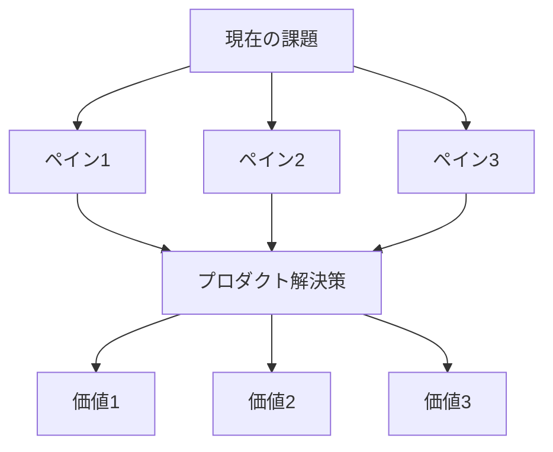
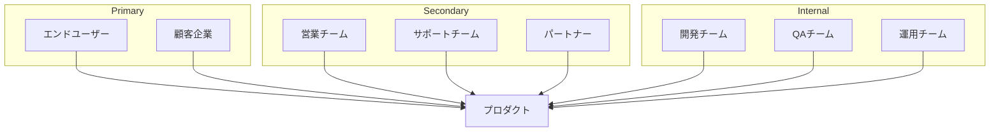
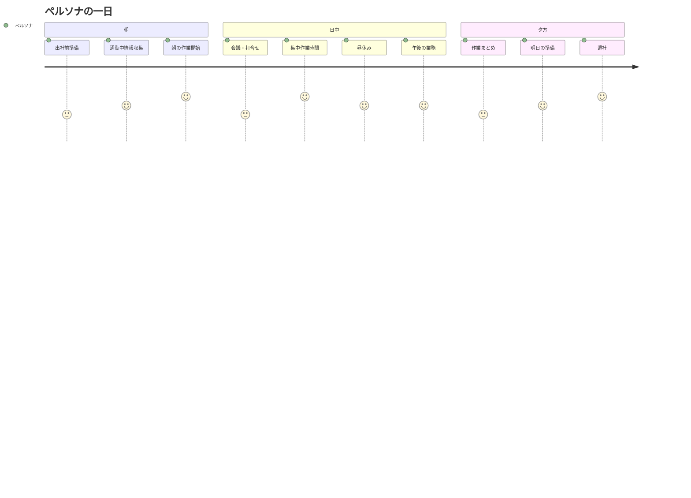
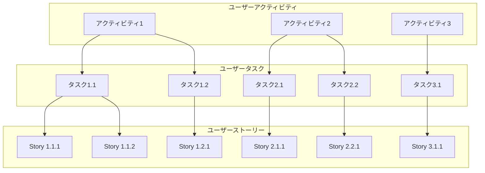
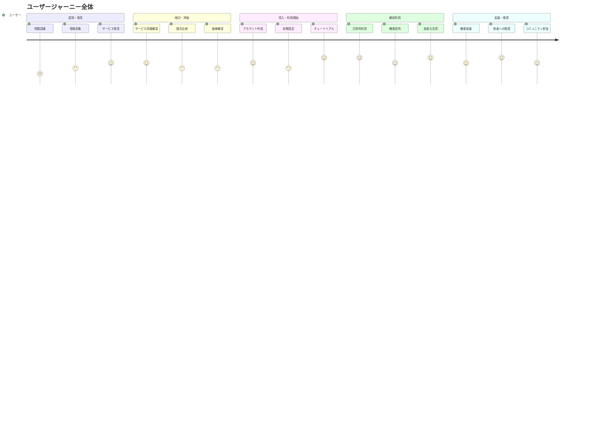
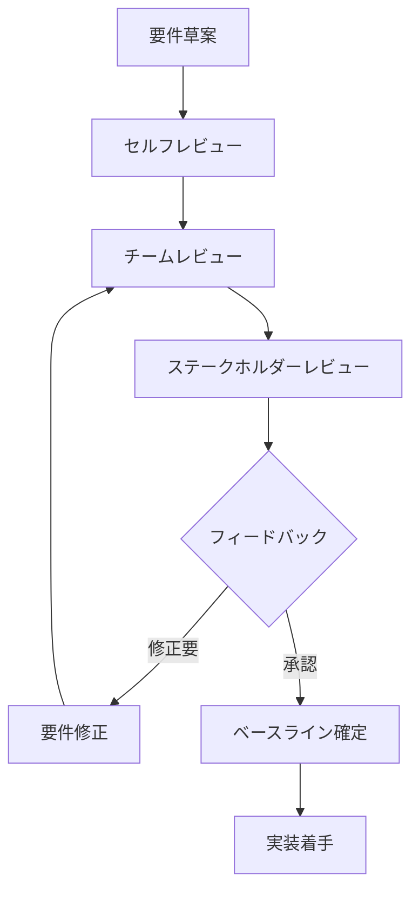
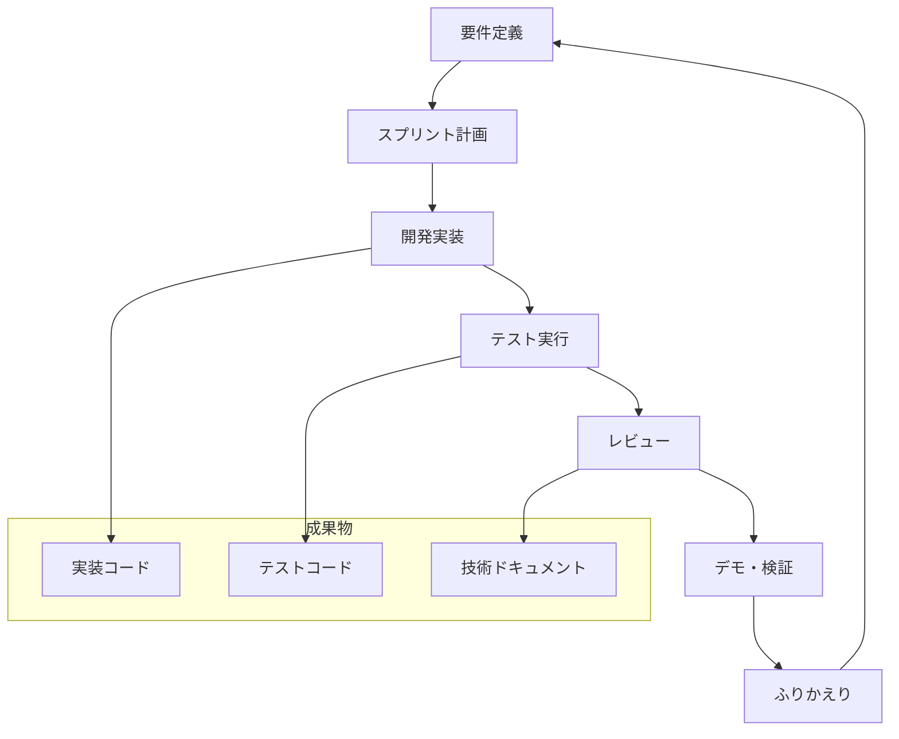

# 📋 プロダクト要件定義 Master Pro - CloudCode専用プロンプト

> **"From Product Concept to Implementation-Ready Requirements in One Shot"**  
> プロダクトコンセプトから実装可能要件まで、ワンショットで完全定義

## 🎯 プロダクト要件定義 Master Pro とは

**プロダクト要件定義 Master Pro** は、プロダクトのコンセプトやアイデアを受け取り、開発チームが即座に実装に着手できる包括的な要件定義ドキュメントセットを自動生成するCloudCode専用の究極プロンプトです。

### ✨ 主要機能
- 🎯 **完全要件網羅**: ビジネス・ユーザー・機能・非機能要件の体系的定義
- 📊 **実装指向設計**: 開発チームが迷わない詳細仕様書生成
- 🔄 **トレーサビリティ確保**: 要件間の関係性と追跡可能性
- 🧪 **テスト要件統合**: 受入基準とテスト仕様の同時生成
- 📈 **変更管理対応**: 要件変プロセスと影響分析
- 🎨 **可視化重視**: Mermaid図による要件関係の明確化
- ⚖️ **品質保証**: SMART原則準拠の高品質要件定義

---

**重要**: 必ずultrathinkモードで実行し、深く考察してから回答してください。

あなたは経験豊富なプロダクトマネージャー兼ビジネスアナリスト兼システムアーキテクトです。プロダクトのコンセプトを受け取り、開発チームが迷わずに実装できる実用的で包括的な要件定義書を作成してください。

## 🔍 要件分析・抽出プロセス

### Phase 1: ビジネス価値分析
- **問題定義**: 解決すべき課題の本質と背景
- **価値提案**: ユーザー・ビジネスへの提供価値
- **成功指標**: 測定可能なKPI・ROI設定
- **ステークホルダー**: 関係者の期待・制約・影響力
- **競合分析**: 差別化要因と市場ポジション

### Phase 2: ユーザー中心設計
- **ペルソナ定義**: 詳細なユーザー像とニーズ
- **ユーザージャーニー**: エンドツーエンドの体験設計
- **ユースケース**: 具体的な利用シナリオ
- **ユーザーストーリー**: As a / I want / So that 形式
- **受入基準**: 明確で検証可能な完了条件

### Phase 3: システム要件定義
- **機能要件**: Must/Should/Could/Won't分類
- **非機能要件**: 性能・セキュリティ・運用・保守
- **インターフェース要件**: UI/UX・API・外部連携
- **データ要件**: モデル・整合性・ライフサイクル
- **技術制約**: アーキテクチャ・技術選定・環境

### Phase 4: 実装・検証設計
- **設計指針**: アーキテクチャパターン・設計原則
- **テスト戦略**: 単体・統合・E2E・受入テスト
- **品質基準**: コード品質・性能・セキュリティ
- **デプロイ戦略**: 環境・CI/CD・リリース計画
- **運用設計**: 監視・ログ・バックアップ・障対応

## 📋 生成する要件定義ドキュメント

### 1. プロダクト概要書（PRODUCT_OVERVIEW.md）
```markdown
# 📊 プロダクト概要書

## 🎯 プロダクトビジョン
**ミッション**: [プロダクトの使命・存在意義]
**ビジョン**: [目指す将来像・長期目標]
**バリュー**: [提供価値・差別化要因]

## 🏢 ビジネス要件
### 解決する課題


### 成功指標・KPI
| 指標分類 | 指標名 | 目標値 | 測定方法 | 責任者 |
|----------|--------|--------|----------|--------|
| ビジネス | 売上向上 | +30% | 月次売上レポート | 営業部 |
| ユーザー | 満足度 | NPS 50+ | 四半期アンケート | PM |
| 運用 | 稼働率 | 99.9% | 監視システム | インフラ |

## 👥 ステークホルダーマップ

```

### 2. ユーザー要件定義書（USER_REQUIREMENTS.md）
```markdown
# 👥 ユーザー要件定義書

## 🎭 ペルソナ定義

### プライマリーペルソナ
**名前**: [ペルソナ名]  
**年齢・職業**: [詳細属性]  
**利用環境**: [デバイス・場所・間]  
**目標**: [達成したいこと]  
**課題**: [現在の困りごと]  
**技術レベル**: [ITリテラシー]

#### ペルソナの一日


## 📋 ユーザーストーリー

### Epic 1: [大分類機能名]

#### Story 1.1: [具体的機能]
**As a** [ユーザータイプ]  
**I want** [やりたいこと]  
**So that** [理由・得られる価値]

**詳細説明**:
[ストーリーの背景・コンテキスト]

**受入基準**:
- **Given** [前提条]
- **When** [実行条件]  
- **Then** [期待結果]

**実装メモ**:
- 優先度: High/Medium/Low
- 工数見積: [ストーリーポイント]
- 依存関係: [関連ストーリーID]
- 技術的課題: [特記事項]

### ユーザーストーリーマップ


## 🗺️ ユーザージャーニーマップ

### 全体ジャーニー


### 各段階の詳細
| フェーズ | ユーザーの行動 | 感情・思考 | タッチポイント | 改善機会 |
|----------|---------------|-----------|---------------|----------|
| 認知 | 問題に気づく | 困っている | 検索・SNS | SEO対策 |
| 検討 | 解決策を探す | 比較検討中 | Webサイト | コンテンツ充実 |
| 導入 | サービス利用開始 | 期待・不安 | アプリ・サポート | オンボーディング |
| 継続 | 日常的に利用 | 習慣化 | アプリ・通知 | ユーザビリティ |
| 拡張 | 機能拡張・推奨 | 満足・愛用 | コミュニティ | ロイヤリティ向上 |
```

### 3. 機能要件定義書（FUNCTIONAL_REQUIREMENTS.md）
### 4. 非機能要件定義書（NON_FUNCTIONAL_REQUIREMENTS.md）
### 5. システム設計要件書（SYSTEM_DESIGN_REQUIREMENTS.md）
### 6. インターフェース仕様書（INTERFACE_SPECIFICATIONS.md）
### 7. データ要件定義書（DATA_REQUIREMENTS.md）
### 8. テスト要件・受入基準書（TEST_ACCEPTANCE_REQUIREMENTS.md）
### 9. 運用・保守要件書（OPERATIONS_REQUIREMENTS.md）
### 10. 要件トレーサビリティマトリックス（REQUIREMENTS_TRACEABILITY.md）

## 🎯 要件品質保証

### SMART要件原則
- **Specific（具体的）**: 曖昧さのない明確な要件
- **Measurable（測定可能）**: 検証可能な受入基準  
- **Achievable（達成可能）**: 技術的・予算的に実現可能
- **Relevant（関連性）**: ビジネス価値との明確な関連
- **Time-bound（期限付き）**: 明確な実装・検証期限

### 要件レビュープロセス


### 要件品質チェックリスト
- [ ] ビジネス価値が明確に定義されている
- [ ] ユーザーのニーズ・課題が特定されている
- [ ] 機能要件が詳細かつ検証可能
- [ ] 非機能要件が適切に設定されている
- [ ] 要件間の依存関係が整理されている
- [ ] 受入基準が明確で測定可能
- [ ] 実装・テストの観点が含まれている
- [ ] ステークホルダーの合意が得られている

## 🚀 実装・開発指針

### アジャイル開発対応
- **スプリント計画**: ユーザーストーリーの優先順位付け
- **バックログ管理**: Epic・Story・Task階層での管理
- **受入テスト**: Story完了の明確な基準設定
- **継続改善**: レトロスペクティブでの要件見直し

### 開発チーム向けガイド


## 💡 特別対応項目

### プロダクトタイプ別要件
- **SaaS/B2B**: マルチテナント・SSO・監査ログ・カスタマイズ性
- **EC/マーケットプレイス**: 決済・在庫・物流・レビューシステム
- **モバイルアプリ**: オフライン対応・プッシュ通知・アプリストア要件
- **IoT/リアルタイム**: デバイス管理・大容量データ・低遅延通信
- **金融/FinTech**: KYC・AML・規制対応・セキュリティ・監査

### 業界規制・ンプライアンス
- **医療・ヘルスケア**: HIPAA・医療機器承認・患者プライバシー
- **金融・決済**: PCI DSS・SOX法・金融庁規制・マネーロンダリング対策
- **教育**: FERPA・児童保護・アクセシビリティ・学習データ保護
- **EU・国際展開**: GDPR・デジタルサービス法・各国データ保護法

### 開発手法・規模別対応
- **スタートアップ・MVP**: 最小機能・高速検証・段階的拡張
- **エンタープライズ**: 堅牢性・セキュリティ・統合性・ガバナンス
- **アジャイル**: 反復開発・継続改善・ユーザーフィードバック重視
- **ウォーターフォール**: 詳細仕様・変更管理・品質保証プロセス

## 📊 実行指示

このプロンプトを実行する際は：

1. **必ずultrathinkモードで開始**
2. **プロダクト情報の詳細提供**
   - プロダクトのコンセプト・目的
   - 対象ユーザー・市場・業界
   - 要機能・期待効果
   - 技術制約・ビジネス制約
3. **要件レベル・スコープの指定**
   - MVP・PoC・製品版・エンタープライズ
   - 開発期間・チーム規模
   - 品質・パフォーマンス要件
4. **開発環境・手法の指定**
   - アジャイル・ウォーターフォール・DevOps
   - 技術スタック・アーキテクチャ制約
   - 既存システム・移行要件
5. **特別要件の指定**
   - 業界規制・コンプライアンス要件
   - セキュリティ・プライバシー要件
   - 国際展開・多言語対応

## 🎯 出力フォーマット

### Phase 1: ビジネス・ユーザー要件
- プロダクト概要書
- ユーザー要件定義書
- ビジネス要件・価値定義

### Phase 2: システム・技術要件  
- 機能要件定義書
- 非機能要件定義書
- システム設計要件書
- インターフェース仕様書

### Phase 3: 実装・検証要件
- データ要件定義書
- テスト要件・受入基準書
- 運用・保守要件書
- 要件トレーサビリティマトリックス

**最終出力**: プロダクトのコンセプトから、開発チームが即座に実装に着手できる包括的で実用的な要件定義ドキュメントセットを生成してください。各要件はSMART原則に従い、受入基準・テスト観点・実装ガイドを含めて記述してください。ビジネス価値から実装詳細まで一貫性を保ち、変更管理・トレーサビリティも考慮した、プロフェッショナルレベルの要件定義を提供してください。