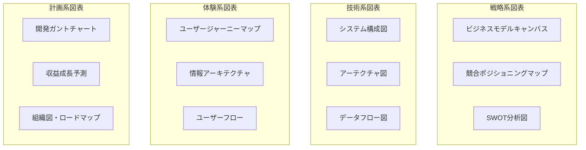

# 📖 ProductPlanner Pro 使い方ガイド

> **"From Idea to MVP Blueprint in One Shot"**  
> アイデアからMVP設計まで、ワンショットで完全企画

## 🎯 ProductPlanner Pro とは

**ProductPlanner Pro** は、Webアプリのアイデアを受け取り、市場調査から技術設計まで包括的なプロダクト企画書を自動生成するCloudCode/Claude Chat専用プロンプトです。

### ✨ 何ができるの？
- 🧠 **戦略的市場分析**: 競合・ユーザー・市場機会の徹底調査
- 📋 **包括的企画書生成**: 15種類の専門企画ドキュメント自動作成
- 🎨 **ビジュアル企画資料**: Mermaid図による企画可視化
- 🛠️ **技術設計提案**: アーキテクチャから開発計画まで
- 💰 **ビジネスモデル設計**: 収益化戦略と成長ロードマップ
- 📊 **リソース算出**: 予算・期間・チーム構成の自動計算
- ⚖️ **法的リスク分析**: 規制・コンプライアン要件の特定

## 🚀 基本的な使い方

### Step 1: プロンプト準備
[ProductPlanner Proのメインプロンプト](./prompt.md)を使用

### Step 2: アイデア情報の入力
以下の形式で情報を追加：

```markdown
ProductPlanner Proで「[あなたのアイデア]」のWebアプリを企画してください。

課題: [解決したい具体的な課題]
ターゲット: [想定するユーザー層]
想定ユーザー数: [目標ユーザー数]
希望ローンチ: [ローンチ時期]
品質レベル: [MVP/フル機能/エンタープライズ]
市場: [対象市場]
参考サービス: [類似・参考サービス]
重視する要素: [技術・ビジネス・デザイン等]
```

### Step 3: 実行
- **Claude Chat**: 上記をそのまま送信
- **CloudCode**: プロンプト + アイデア情報を貼り付けて実行

## 🎨 実行環境別の使い方

### 💬 Claude Chat での使い方

```
ProductPlanner Proで「チーム向けタスク管理×AI」のWebアプを企画してください。

課題: 中小企業でプロジェクトの進捗管理が属人化し、遅延や品質問題が頻発している
ターゲット: 20-50名規模の企業のプロジェクトマネージャー・チームリーダー
想定ユーザー数: 月間10,000アクティブユーザー（3年後）
希望ローンチ: 1年後
品質レベル: フル機能版
市場: 日本国内
参考サービス: Notion + monday.com の中間的なポジション、AIによる自動進捗予測機能
重視する要素: 使いやすさとAI機能の差別化
```

### 🛠️ CloudCode での使い方

1. **CloudCodeを起動**
2. **メインプロンプトをコピペ**（[prompt.md](./prompt.md)の内容全て）
3. **アイデア情報を追記**
```bash
# CloudCode実行例
# プロンプト全文 + 以下のアイデア情報を追加

ProductPlanner Proで「地域特産品×D2C」のWebアプリを企画してください。

課題: 地方の優良な特産品が都市部消費者にかない
ターゲット: 都市部在住30-50代、年収600万円以上の食にこだわりがある層
想定ユーザー数: 月間50,000ユーザー（2年後）
希望ローンチ: 6ヶ月後
品質レベル: MVP
市場: 日本国内（将来的に海外展開）
参考サービス: 47CLUB + 食べチョクの要素を組み合わせ
```
4. **実行して完全な企画書が自動生成**

## 📋 生成される成果物

### 📊 15種類の専門ドキュメント

| ドキュメント | 内容 | 活用場面 |
|-------------|------|----------|
| **エグゼクティブサマリー** | 投資家向け概要 | ピッチ・資金調達 |
| **市場分析レポート** | 競合・機会分析 | 事業性検証 |
| **ユーザーリサーチ** | ペルソナ・ジャーニー | UX設計・マーケティング |
| **プロダクト仕様書** | 機能・要件定義 | 開発チーム・PM |
| **技術アーキテクチャ** | システム設計 | エンジニア・CTO |
| **UI/UX設計** | デザン指針 | デザイナー・フロントエンド |
| **ビジネスモデル** | 収益構造 | 経営陣・投資家 |
| **開発計画** | 予算・期間・チーム | プロジェクト管理 |
| **マーケティング戦略** | Go-to-Market | マーケティングチーム |
| **リスク分析** | 対策・緩和策 | 経営陣・投資家 |
| **収支予測** | 5年間財務計画 | CFO・投資家 |
| **MVPロードマップ** | 最小実証版計画 | 開発チーム・PM |
| **法的コンプライアンス** | 規制対応 | 法務・コンプライアンス |
| **チーム組織設計** | 採用・報酬戦略 | HR・経営陣 |
| **Exit戦略** | IPO・M&A計画 | 創業者・投資家 |

### 🎨 豊富な図表・可視化



## 🎯 活用シーン・対象者

### 📈 活用シーン

#### 🚀 起業・スタートアップ
- **アイデア検証**: 事業性の客観的評価
- **資金調達**: 投資家向け企画書作成
- **チーム組成**: 開発・事業メンバー採用
- **MVP開発**: 最小実証版の設計・開発

#### 🏢 企業内新規事業
- **社内提案**: 新規事業の企画提案書
- **予算申請**: 開発予算・リソース要求
- **外部連携**: パートナー企業との協業提案
- **M&A検討**: 買収・投資対象の評価

#### 🎓 学習・スキルアップ
- **ポートフォリオ**: 転職就活用の企画書
- **学習材料**: プロダクト企画スキル向上
- **ケーススタディ**: 実践的な企画経験

### 👥 対象者

| 対象者 | 主な活用目的 | 重点ドキュメント |
|--------|-------------|-----------------|
| **起業家・創業者** | 事業計画・資金調達 | エグゼクティブサマリー、収支予測、Exit戦略 |
| **プロダクトマネージャー** | 企画・要件定義 | プロダクト仕様、MVP、ユーザーリサーチ |
| **エンジニア・CTO** | 技術設計・開発計画 | 技術アーキテクチャ、開発計画、リスク分析 |
| **新規事業担当者** | 社内提案・事業検証 | 市場分析、ビジネスモデル、財務計画 |
| **投資家・VC** | 投資判断・DD | 全ドキュメント（包括的評価） |

## 💡 効果的な使い方のコツ

### 🎯 入力情報のコツ

#### ✅ Good（具体的・詳細）
```
課題: 中小企業（20-100名）で、プロジェクトの進捗が見づらく、
      期限遅延が30%発生。Excel管理では限界があり、
      チーム間の情報共有も属人化している

ターゲット: IT企業・コンサル・制作会社のプロジェクトマネージャー、
          年収500-800万円、30-45歳、チーム5-15名管理
```

#### ❌ Bad（抽象的・曖昧）
```
課題: プロジェクト管理が大変
ターゲット: ビジネスマン
```

### 📊 参考サービスの活用

#### 効果的な参考サービス指定
```
参考サービス: 
- Notion（情報整理の柔軟性）+ monday.com（プロジェクト管理）
- Slack（コミュニケーション）+ Linear（課題管理）
- 新機能：AI による工数予測・リスク検知
```

### 🔧 カスタマイズのポイント

#### 業界特化の要求
```
業界固有要件:
- 金融業界：金融庁規制、個人情報保護、監査対応
- 医療業界：医療機器承認、HIPAA、電子カルテ連携
- 教育業界：文科省ガイドラン、学習指導要領対応
```

## 📈 成果物の活用方法

### 🎤 投資家ピッチでの活用

1. **エグゼクティブサマリー** → ピッチデック作成
2. **市場分析** → TAM/SAM/SOM説明
3. **ビジネスモデル** → 収益構造・Unit Economics
4. **収支予測** → ROI・リターン説明
5. **Exit戦略** → 投資回収シナリオ

### 🛠️ 開発プロジェクトでの活用

1. **技術アーキテクチャ** → 技術選定・設計方針
2. **開発計画** → チーム組成・スケジュール
3. **MVPロードマップ** → 最初の開発スコープ
4. **プロダクト仕様** → 要件定義・機能設計

### 📢 マーケティングでの活用

1. **ユーザーリサーチ** → ペルソナ・メッセージング
2. **マーケティング戦略** → Go-to-Market実行
3. **競合分析** → ポジショニング・差別化
4. **ビジネスモデル** → 価格戦略・収益化

## ⚠️ 注意点・制限事項

### 🔍 生成結果の精度について
- AIが業界知識・市場データに基づいて生成
- **実際の市場調査・ユーザーインタビューで検証推奨**
- 数値は参考値として活用し、詳細検証が必要

### 📋 カスタマイズの必要性
- 生成された企画書は**ベースライン**として活用
- 自社・プロジェクト固有の要件に合わせて調整
- 法的要件は必ず専門家に相談

### 🎯 継続的な更新
- 市場環境・競合状況の変化に応じて更新
- ユーザーフィードバックを基に企画書をブラッシュアップ
- 開発進捗に合わせて計画を調整

## 🤝 サポート・コミュニティ

### 📚 関連リソース
- [ProductPlanner Pro メインプロンプト](./prompt.md)
- [使用例集](./examples.md)
- [開発プロンプト集リポジトリ](../../../)

### 💬 質問・フィードバック
- GitHub Issues でのフィードバック歓迎
- 改善提案・機能要望の投稿
- 使用事例・成功事例の共有

---

**🎯 ProductPlanner Pro で、あなたのアイデアを次のレベルへ！**

アイデアから実現可能なビジネスプランまで、一撃で完全企画を体験してください。